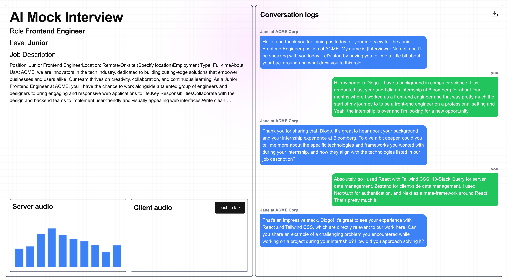

# AI Mock Interview

## Description

This is a web application that allows users to practice mock interviews with an AI. The user selects a role and level, and optionally a job description. The AI is powered by OpenAI's realtime API multi-modal model that suports speech to speech conversation.

The server can be found [here](https://github.com/nip10/mock-interview-ai-server). It uses websockets to communicate with the client.

## Reference

- [Next.js](https://nextjs.org/docs/getting-started)
- [OpenAI Realtime Console](https://github.com/openai/openai-realtime-console)
